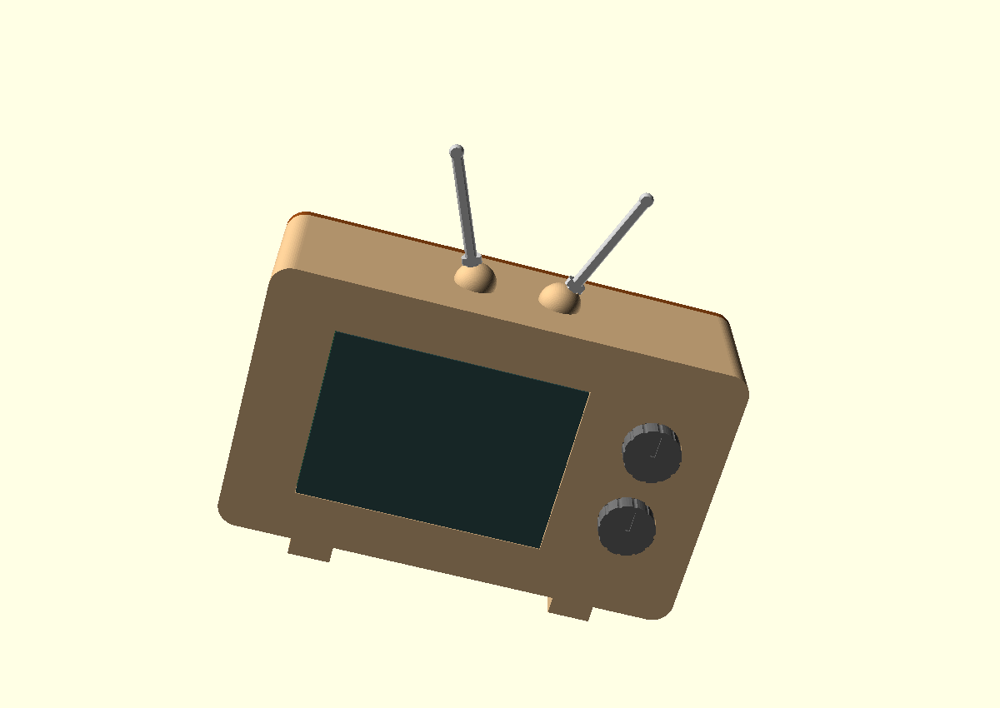
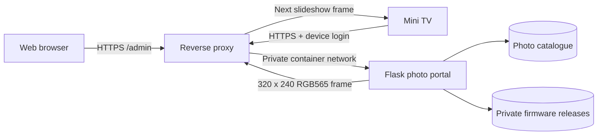
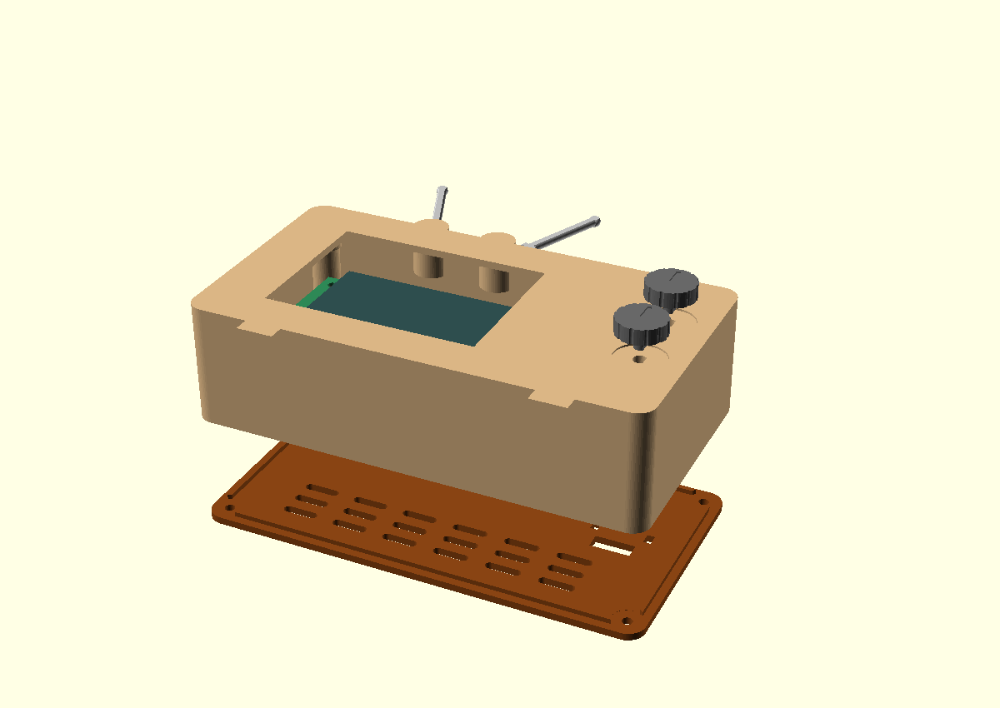
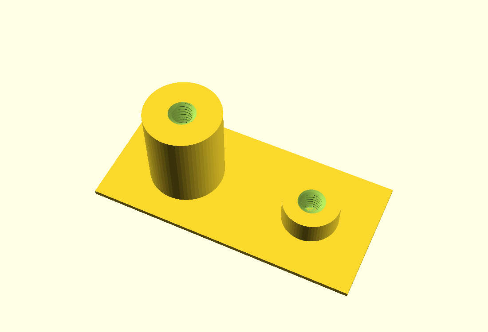
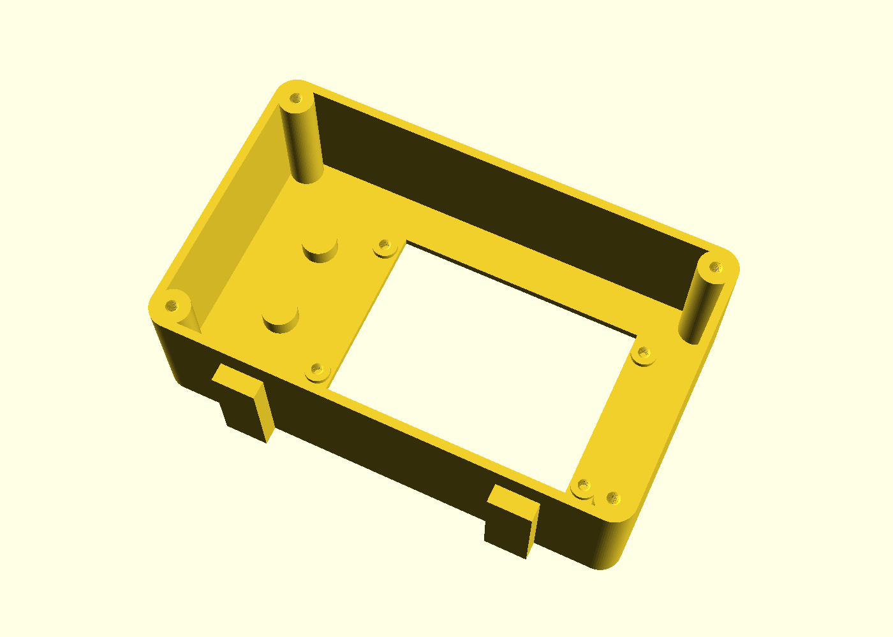
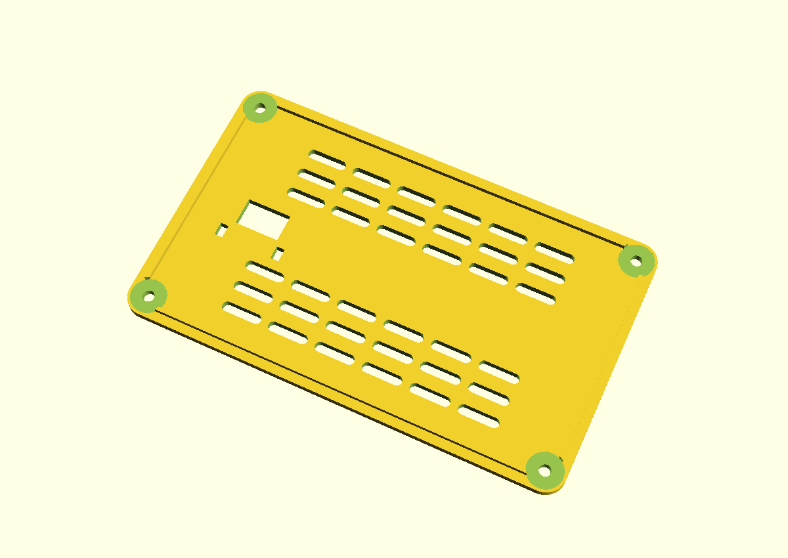
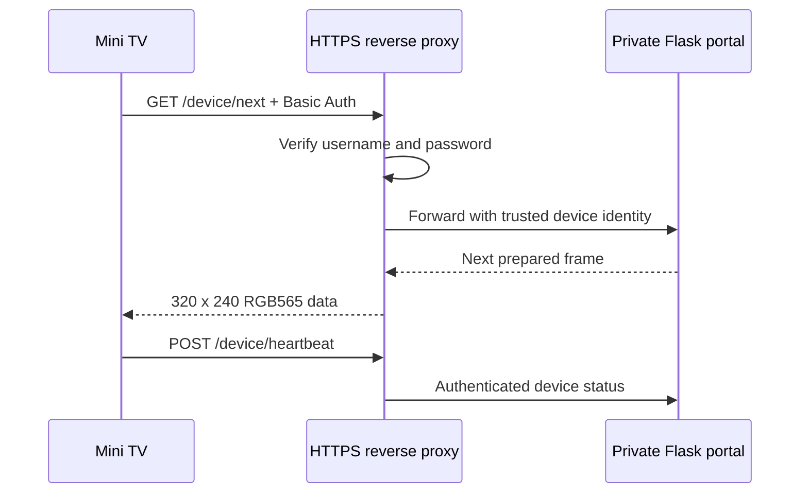

# Mini TV

A DIY Wi-Fi picture frame built around an **ESP32-2432S028** display. The
project combines ESP32 firmware, a self-hosted photo portal, and a printable
retro television enclosure.



The finished device can:

- display an ordered slideshow supplied by your own private server
- keep displaying a saved frame when the network is temporarily unavailable
- report device status to the photo portal
- receive signed firmware updates
- let you upload, arrange, preview, and remove pictures in a browser
- fit inside the included 3D-printable retro TV enclosure

This repository is a reusable blank template. It contains no personal photos,
Wi-Fi credentials, passwords, private signing keys, or deployment-specific
network details.

## How the pieces work together



The browser is the control panel. The Mini TV is a separate authenticated
client. NGINX (or an equivalent reverse proxy) terminates HTTPS, verifies the
device login, and forwards trusted requests to the private Flask application.
The Flask application should not be exposed directly to the internet.

## Choose your starting point

| Goal | What you need | Start here |
| --- | --- | --- |
| See the portal without hardware | Python 3 and a browser | [Preview the portal](#1-preview-the-photo-portal) |
| Test the display | ESP32-2432S028, USB data cable, VS Code, PlatformIO | [Test the screen](#2-build-and-test-the-display) |
| Build the enclosure | 3D printer or printing service | [Print the enclosure](#3-print-the-enclosure) |
| Run the complete picture frame | All of the above plus a server, domain name, and HTTPS | [Deploy the complete system](#4-deploy-the-complete-system) |

## What you need

### Hardware

- one ESP32-2432S028 display board, often called a Cheap Yellow Display (CYD)
- a data-capable USB cable that fits your board revision
- a stable USB power supply for normal operation
- a microSD card only if you extend the project to use one; it is not required
  by the included network slideshow
- the printed enclosure parts and fasteners described below

ESP32-2432S028 boards are sold with different display controllers and connector
layouts. This repository includes ST7789 and ILI9341 build profiles, but you must
verify your own board. The manufacturer's
[reference downloads](https://www.guition.com/-download) are useful background;
physical measurements and a display test take priority.

### Software

- [Visual Studio Code](https://code.visualstudio.com/)
- the [PlatformIO IDE extension](https://platformio.org/install/ide?install=vscode)
- [Python 3](https://www.python.org/downloads/)
- Git, if you want to clone the repository
- Docker and a reverse proxy for a permanent server deployment
- OpenSCAD and a slicer such as Bambu Studio only if you want to modify or print
  the enclosure

## Project layout

```text
mini-tv/
|-- firmware/             ESP32 source, local settings template, and OTA tools
|-- homelab/portal/       Flask portal, browser interface, tests, and NGINX config
|-- enclosure/            OpenSCAD sources, STL files, renders, and print notes
|-- .gitignore            Prevents private/generated files from entering Git
|-- LICENSE               MIT license
`-- README.md             This guide
```

## 1. Preview the photo portal

Do this first if you want to explore the interface without configuring a server
or connecting the display. The preview listens only on your own computer and
creates temporary sample images.

1. Clone the repository and enter its directory:

   ```powershell
   git clone https://github.com/brianblong/CYD-Mini-TV.git
   cd CYD-Mini-TV
   ```

2. Create a private Python environment:

   ```powershell
   python -m venv .venv
   ```

3. Activate it in PowerShell:

   ```powershell
   .\.venv\Scripts\Activate.ps1
   ```

   If PowerShell blocks activation, use the environment's Python directly:

   ```powershell
   .\.venv\Scripts\python.exe -m pip install -r homelab\portal\requirements.txt
   .\.venv\Scripts\python.exe homelab\portal\preview.py
   ```

4. If activation succeeded, install the dependencies and start the preview:

   ```powershell
   python -m pip install -r homelab\portal\requirements.txt
   python homelab\portal\preview.py
   ```

5. Open <http://127.0.0.1:8765/admin/> in your browser.

6. When finished, return to the terminal and press **Ctrl+C** to stop it.

The preview is for inspecting the design. For persistent photos and an actual
Mini TV connection, continue to the deployment section.

## 2. Build and test the display

Start with the safe blank configuration. This verifies the display controller,
orientation, colors, USB connection, and build tools before credentials are added.

1. Install VS Code and the PlatformIO IDE extension.
2. In VS Code, choose **File > Open Folder** and open the repository's
   `firmware` folder—not the repository root.
3. Connect the ESP32 display with a data-capable USB cable. A charge-only cable
   can power the board but cannot upload firmware.
4. Wait for PlatformIO to finish installing the pinned ESP32 platform and
   libraries on its first run.
5. In the PlatformIO sidebar, open
   **Project Tasks > cyd_st7789_check > General > Build**.
6. A successful build ends with `SUCCESS`. This check uses the public blank
   settings and is safe to compile, but is not intended for normal network use.
7. To test the common ST7789 board, select
   **Project Tasks > cyd_st7789 > General > Upload**. With blank settings, the
   screen shows the neutral startup/color test instead of connecting to Wi-Fi.
8. If the image has the wrong colors, orientation, or no usable output, try the
   **cyd_ili9341** environment.
9. Open **Monitor** under the same environment to view diagnostic messages. The
   serial speed is **115200 baud**.
10. If PlatformIO cannot choose a port, find the board's COM port in Windows
    Device Manager and temporarily add these lines under `[env]` in
    `firmware/platformio.ini`:

    ```ini
    upload_port = COM3
    monitor_port = COM3
    ```

    Replace `COM3` with the port shown on your computer. Avoid committing a
    machine-specific port unless you intentionally want it in your fork.

For controller details, see the [firmware guide](firmware/README.md).

## 3. Print the enclosure

The recommended enclosure is **Prototype V3**, which has threads built into its
PCB supports and rear posts. It reuses the V2 exterior geometry and no longer
requires eight separate nuts.



### Parts to print

From `enclosure/prototype_v3/`:

- `housing.stl` — main television body
- `back_cover.stl` — removable ventilated rear cover
- `knobs.stl` — decorative front controls
- `antennas.stl` — decorative top antennas

Before printing the full housing, also print:

- `fit_coupon.stl` — small threaded test section
- `test_spacers.stl` — simulates the PCB and back-cover thicknesses



### Suggested print sequence

1. Import `fit_coupon.stl` and `test_spacers.stl` into your slicer at **100%**
   scale. Do not mirror them.
2. Start with PLA, a **0.20 mm** layer height, four walls, 100% infill, and no
   supports for these small tests.
3. Inspect the sliced threads. If the 0.5 mm pitch is poorly formed or binds,
   retry the tests at **0.08 or 0.10 mm** layer height.
4. Test the short post with the 1 mm spacer and an M3 x 4 mm screw. Test the tall
   post with the 2.4 mm spacer and an M3 x 10 mm screw. Turn gently by hand and
   never force a binding screw.
5. After both tests pass, import `housing.stl` front-down with the cavity facing
   upward. A starting point is four walls, five top/bottom layers, and 15% infill.
6. Paint supports only beneath the lower outside curves of the antenna bases.
   Keep supports out of the threads and sockets.
7. Print the remaining back cover, knobs, and antennas at 100% scale.



### Assembly

1. Disconnect power from the display.
2. Insert the PCB from the rear with USB-C pointing toward the knob side.
3. Confirm all four PCB corners rest on their support pads and the display glass
   sits flush with the front opening.
4. Attach the PCB using four M3 x 4 mm screws. Tighten only until snug; bending
   the PCB or loading the glass can damage it.
5. Route the USB cable through the rear opening.
6. Install the back cover using four M3 x 10 mm screws.
7. Fit the decorative knobs and antennas.



Read the complete [Prototype V3 print and assembly notes](enclosure/prototype_v3/README.md)
before printing. Dimensions and threaded fits vary by printer, material, nozzle,
and board revision, so the small test print is intentional.

## 4. Deploy the complete system

This stage assumes you know how to administer a server or homelab. The included
configuration provides the application pieces, but does not automatically buy a
domain, configure your router, obtain TLS certificates, or back up your data.

### 4.1 Prepare private server storage

On the Linux server, create persistent photo and release directories:

```bash
sudo mkdir -p /opt/mini-tv/data/photos
sudo mkdir -p /opt/mini-tv/data/private/firmware/tv-local
sudo mkdir -p /opt/mini-tv/data/private/firmware/tv-remote
sudo chmod 700 /opt/mini-tv/data/private
```

Keep these directories outside the public Git checkout. Photos, generated
catalogue data, and firmware releases are personal deployment data.

### 4.2 Create the portal's private configuration

1. Copy `homelab/portal/portal.env.example` to a private location named
   `portal.env`.
2. Generate a Flask session key:

   ```powershell
   python -c "import secrets; print(secrets.token_hex(32))"
   ```

3. Generate the hash for the password you will use to sign into the website:

   ```powershell
   python -c "from werkzeug.security import generate_password_hash; print(generate_password_hash(input('Password: ')))"
   ```

4. Put the generated values into `PORTAL_SECRET_KEY` and
   `ADMIN_PASSWORD_HASH`. You may also change the generic site title, tagline,
   and display names.

Never put the completed `portal.env` in Git, a screenshot, an issue, or a shared
chat. The repository's `*.env` rule is a safety net, not a password vault.

### 4.3 Run the portal container

Build `homelab/portal/Dockerfile`, mount persistent photo storage at `/data`,
mount private releases at `/firmware` as read-only, and load the private
environment file. Keep container port 8000 on a private Docker network.

The provided `nginx-default.conf` expects the upstream container to be named
`portal`. Install it as the active server block for the reverse-proxy container,
not as a second conflicting block. Provide HTTPS at the public edge before
sending real credentials or photos.

### 4.4 Add device authentication

Create one NGINX Basic Auth identity per display, such as `tv-local` and
`tv-remote`. Give every device a unique generated password. The username used by
the firmware must exactly match the username in the reverse proxy.

Device traffic follows this path:



The Flask device routes trust the identity header supplied by NGINX. Do not
publish port 8000 or allow clients to bypass the reverse proxy.

### 4.5 Configure the Mini TV privately

1. Copy the example file:

   ```powershell
   Copy-Item firmware\include\secrets.example.h firmware\include\secrets.h
   ```

2. Open `firmware/include/secrets.h` and enter:

   - the SSID and password for your 2.4 GHz Wi-Fi network
   - an optional second Wi-Fi network, or leave those two fields blank
   - your HTTPS portal hostname without a path
   - the device username and its matching Basic Auth password

3. Confirm Git is ignoring the completed file:

   ```powershell
   git check-ignore -v firmware/include/secrets.h
   ```

   Git should print the matching `.gitignore` rule. If it prints nothing, stop
   and fix the ignore rule before staging any files.

4. Build and upload the correct `cyd_st7789` or `cyd_ili9341` environment from
   PlatformIO.
5. Watch the 115200-baud serial monitor and verify Wi-Fi, HTTPS, authentication,
   frame download, and portal status reporting.
6. Upload a non-sensitive test picture through `/admin/`, place it in the
   playlist, and confirm it appears on the display.

### 4.6 Verify failure behavior

Before relying on the frame, test each condition separately:

- restart the display and confirm it reconnects
- temporarily stop the portal and confirm the saved frame remains visible
- restore the portal and confirm the slideshow resumes
- try an incorrect device password and confirm the request is rejected
- verify the portal is reachable only through HTTPS
- verify port 8000 is not publicly reachable

## 5. Optional signed firmware updates

USB remains the simplest recovery path. Configure over-the-air updates only
after the basic slideshow is reliable.

1. From the `firmware` directory, initialize a signing identity once:

   ```powershell
   python tools\release.py init
   ```

2. This creates the private signing key and installation-specific public-key
   header in ignored locations. Back up the private key in encrypted storage.
3. Increase the firmware version before every release.
4. Build using the intended device configuration.
5. Package the release using `tools/release.py`.
6. Copy the resulting private binary and manifest into the matching server
   release directory. Upload the binary first and publish the manifest last.
7. Test updates while the display is physically accessible by USB.

Firmware binaries built with real settings contain credentials. Never attach
them to a public GitHub release. See the detailed
[deployment template](firmware/DEPLOYMENT.md) and
[firmware validation guide](firmware/VALIDATION.md).

## Privacy and security checklist

Before every public commit, confirm that you have not staged:

- `firmware/include/secrets.h`
- a completed `.env` file
- Wi-Fi names or passwords
- real domains, internal hostnames, or IP addresses
- personal photographs or generated catalogue data
- Basic Auth password files
- OTA private keys or installation-specific public-key headers
- firmware binaries compiled with credentials

Useful checks:

```powershell
git status
git diff --cached
git check-ignore -v firmware/include/secrets.h
```

`.gitignore` prevents common accidents, but it cannot remove a secret that was
already committed. If that happens, rotate the exposed credential immediately;
deleting the visible line in a later commit does not erase it from Git history.

## Run the automated checks

From the repository root, after installing the portal requirements:

```powershell
python -m unittest discover -s homelab/portal -p "test_*.py"
node --check homelab/portal/static/portal.js
python -m unittest discover -s firmware/tools -p "test_*.py"
```

PlatformIO also provides the `cyd_st7789_check` environment for a safe compile
with blank example credentials.

## More documentation

- [Firmware setup](firmware/README.md)
- [Deployment template](firmware/DEPLOYMENT.md)
- [Device/server protocol](homelab/portal/DEVICE_PROTOCOL.md)
- [Photo portal](homelab/portal/README.md)
- [Enclosure overview](enclosure/README.md)
- [Prototype V3 enclosure](enclosure/prototype_v3/README.md)

## License

The source code and original project files are released under the
[MIT License](LICENSE). Third-party hardware, software, and linked reference
materials remain subject to their respective owners' terms.
